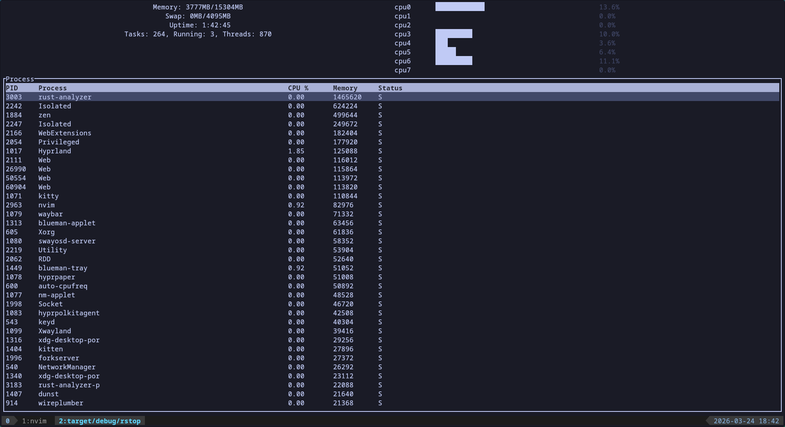

# `Rstop`

> A fast, lightweight, and customizable system monitor CLI inspired by `htop`, written in Rust.


## Features

* Real-time system monitoring (CPU, memory, processes)
* Interactive terminal UI
* Vim keybindings
* Clean and minimal interface
* Written in Rust for performance and safety


## Preview


## Installation

### From Source

Make sure you have Rust installed:

```bash
curl https://sh.rustup.rs -sSf | sh
```

Clone the repository:

```bash
git clone https://github.com/imck037/rstop.git
cd rstop
```

Build the project:

```bash
cargo build --release
```

Run it:

```bash
./target/release/rstop
```

## ️ Keybindings

| Key     | Action                |
| ------- | --------------------- |
| `q`     | Quit                  |
| `↑ / ↓` | Navigate processes    |
| `j / k` | Navigate processes    |
| `c`     | Sort by cpu           |
| `m`     | Sort by memory        |
| `r`     | Refresh               |


## Built With

* [Rust](https://www.rust-lang.org/)
* `ratatui`
* `crossterm`
* `linux \proc filesystem`

## Project Structure

```
src/
├── main.rs
├── proc.rs
├── system.rs
├── test.rs
└── task.rs
```

## Contributing

Contributions are welcome!

1. Fork the repo
2. Create your feature branch (`git checkout -b feature/AmazingFeature`)
3. Commit your changes
4. Push to the branch
5. Open a Pull Request

## Issues

If you find a bug or want to request a feature, open an issue.

## License

This project is licensed under the MIT License.

## Acknowledgements

* Inspired by `htop`
* Thanks to the Rust community 

## Future Improvements

* [ ] Network usage stats
* [ ] Disk I/O monitoring
* [ ] Config file support
* [ ] Theming support
